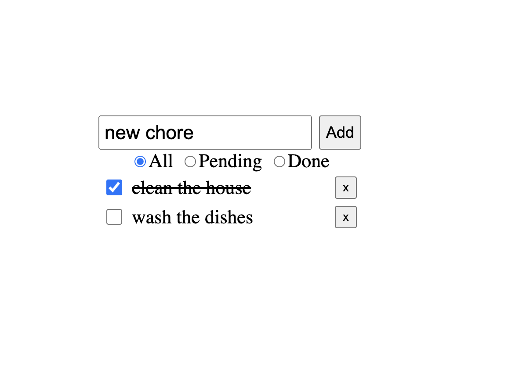

# Description

This is a technical test to create a Todo List application. The application should allow users to add todos, delete todos, mark todos as done, revert todos to pending, and filter todos by status: done, pending, and all. The todos should be managed by the `TodoStoreService`.

## Project Structure

The project is structured as follows:

- `models/todo.model.ts`: Defines the structure that all todos must follow.
- `services/todo-store.service.ts`: Manages all the todos. External libraries to manage the store are not allowed (NgRx, Akita etc).
- `components/todos-filter`: Component to filter the displayed todos.
- `components/todo-item`: Component to display each todo.

## Styles

The application has global styles already configured in the file `src/styles.scss`, by default everything is displayed in the center of the page

- You can use the `todo-list` css class if you want to organize the list of todos
- Each todo has the `todo` css class
- When a todo is marked as done, you should add the `todo--done` class to the todo element

## Requirements

- **Add Todo:** The application should allow the user to add new todos. Use `uuidv4()` to generate the todo's id. The package is already included in the project. Allow the user to add a new todo by clicking the enter key.
- **Delete Todo:** The application should allow the user to delete existing todos.
- **Mark Todo as Done:** The application should allow the user to mark todos as done. When a todo is marked as done, it should have the `todo--done` class.
- **Revert Todo to Pending:** The application should allow the user to revert todos to pending.
- **Filter Todo:** The application should allow the user to filter todos by status: done, pending, and all.
- **Todo Management:** The todos should be managed by the `todo-store.service.ts`.

**NOTE:** You do not need to create the edit functionality.

## Expected Result

